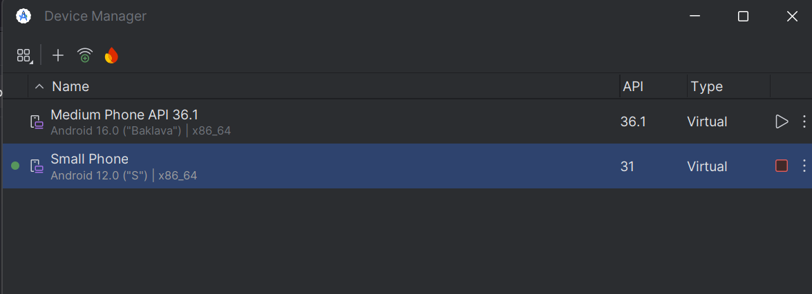

# HEX ADVENT CTF — Rev/Christmas Lottery
tags: android, apktool, frida, mobile

# Challenge 12: Christmas Lottery

TL;DR

1. Run and decompile the apk
2. Find function to generate winning code
3. Hook the winning code using frida
4. Flag: `HEX{Fr1d4_i5_S4nT4s_b3sT_fRi3nD}`

This challenge came with an apk attachment. 

```html
/mnt/d/cysec/CTF/2025/HexAdvent2025/hard_rev ⌚ 16:10:34
$ file christmas-lottery.apk
christmas-lottery.apk: Android package (APK), with gradle app-metadata.properties
```

I first try run and decompile the apk.

To run the apk, I used the android small phone virtual device in android studio. 



While waiting for the emulator to start up, I run apktool to decompile the apk. 

```bash
apktool d christmas-lottery.apk -o christmas-lottery
```

The decompiled code then can be found in the christmas-lottery directory.

```bash
/mnt/d/cysec/CTF/2025/HexAdvent2025/hard_rev ⌚ 16:12:34
$ l christmas-lottery
total 8.0K
drwxrwxrwx 1 jaacc jaacc 4.0K Dec 12 13:09 .
drwxrwxrwx 1 jaacc jaacc 4.0K Dec 12 13:42 ..
-rwxrwxrwx 1 jaacc jaacc 7.5K Dec 12 13:09 AndroidManifest.xml
-rwxrwxrwx 1 jaacc jaacc  338 Dec 12 13:09 apktool.yml
drwxrwxrwx 1 jaacc jaacc 4.0K Dec 12 13:09 assets
drwxrwxrwx 1 jaacc jaacc 4.0K Dec 12 13:09 original
drwxrwxrwx 1 jaacc jaacc 4.0K Dec 12 13:09 res
drwxrwxrwx 1 jaacc jaacc 4.0K Dec 12 13:09 smali
drwxrwxrwx 1 jaacc jaacc 4.0K Dec 12 13:09 unknown
```

Going back to our emulator, we can simply drag the apk to the app and run it.

Here’s how the app looks.


The app is basically a lottery app where you can enter your code, submit code, or restart. 

From this I assumed I can obtain the flag by entering a valid ticket code.

I first checked the `AndroidManifest.xml` file as it describes all the essential information about an android app. From here I get to know the apk package name (com.christmas.lottery) and its main activity (MainActivity). I assumed this is where the lottery logic would be implemented.

```xml
				<activity android:exported="true" android:label="@string/app_name" android:name="com.christmas.lottery.MainActivity" android:theme="@style/Theme.ChristmasLottery">
            <intent-filter>
                <action android:name="android.intent.action.MAIN"/>
                <category android:name="android.intent.category.LAUNCHER"/>
            </intent-filter>
        </activity>
```

Since I know the main activity is at `com.christmas.lottery.MainActivity` , I explore the smali directory `smali/com/christmas/lottery/MainActivity.smali` . From here we can try to reverse the app logic. 

In smali, method names are indicated by `.method` so I first scan through the methods and found the `generateTicketCode` method. 

```xml
.method private generateTicketCode()Ljava/lang/String;
    .locals 13
   <snip>
    iget-wide v9, p0, Lcom/christmas/lottery/MainActivity;->secretSeed:J
	 <snip>
    iget-wide v9, p0, Lcom/christmas/lottery/MainActivity;->secretSeed:J
	 <snip>
.end method
```

There’s a bunch of logic here, but what this does is it use the `secretSeed` (a randomly generated number) to mathematically output the winning ticket. 

What’s interesting about this is that it’s essentially dead code and was never used by the app. 

As seen here there is no invoke instructions that calls this method.


When we click on submit code in the button, what it does is actually call the `validateTicketCodeWithBackend` method. I know this by tracing all functions that has ticket in it using frida-trace.

```xml
PS D:\cysec\CTF\2025\HexAdvent2025> frida-trace -U -n "Christmas Lottery" -j "*!*Ticket*"
Attaching...                                              
Instrumenting...
              
<snip>

Started tracing 14 functions. Web UI available at http://localhost:7881/
           /* TID 0x3f14 */
  9445 ms  MainActivity.validateTicketCodeWithBackend("test click")
```

Now lets check the `validateTicketCodeWithBackend` method. 

```xml
.method private validateTicketCodeWithBackend(Ljava/lang/String;)V
    .locals 3

    iget-object v0, p0, Lcom/christmas/lottery/MainActivity;->mAuth:Lcom/google/firebase/auth/FirebaseAuth;
    <snip>
    if-nez v0, :cond_0
    <snip>
    :cond_0
    <snip>
    new-instance v1, Li/B;

    invoke-direct {v1, p0, p1}, Li/B;-><init>(Lcom/christmas/lottery/MainActivity;Ljava/lang/String;)V

    invoke-virtual {v0, v1}, Lcom/google/android/gms/tasks/Task;->addOnCompleteListener(Lcom/google/android/gms/tasks/OnCompleteListener;)Lcom/google/android/gms/tasks/Task;

    return-void
.end method
```

This method lets us pass any string to the request handler while being logged in to the firebase. 

So what we can do here is call the `generateTicketCode` method then pass the value to `validateTicketCodeWithBackend` , that way we can get the valid code. To do this we can use Frida, a free toolkit that lets you hook any function and inject your script when the apk runs.

First, let’s create the solver script. Here’s mine

```jsx
Java.perform(function() {
    var MainActivity = Java.use("com.christmas.lottery.MainActivity");
    var Toast = Java.use("android.widget.Toast");

    // pass the generated ticket code to validate function
    MainActivity.validateTicketCodeWithBackend.implementation = function() {
        var ticketCode = this.generateTicketCode();
        console.log(ticketCode);
        this.validateTicketCodeWithBackend(ticketCode);
    };

    // hook the notif that contains flag
    Toast.makeText.overload('android.content.Context', 'java.lang.CharSequence', 'int').implementation = function(context, text, duration) {
        var flag = text.toString();
        console.log(flag);
    };
});
```

In this script I pass the generated ticket code from `generateTicketCode` to `validateTicketCodeWithBackend`. Then also added a hook to the notification so I can easily copy paste the flag.

To run the solver, first run the frida server

```jsx
PS D:\cysec\CTF\2025\HexAdvent2025\hard_rev> adb shell
emulator64_x86_64:/ $ cd data/local/tmp                     
emulator64_x86_64:/data/local/tmp $ su
emulator64_x86_64:/data/local/tmp # ls
frida-server-17.5.1-android-x86_64
emulator64_x86_64:/data/local/tmp # ./frida-server-17.5.1-android-x86_64> 
```

Then run the solver with the following command

```jsx
PS D:\cysec\CTF\2025\HexAdvent2025\hard_rev> frida -U -f com.christmas.lottery -l solve.js
     ____
    / _  |   Frida 17.5.1 - A world-class dynamic instrumentation toolkit       
   | (_| |
    > _  |   Commands:
   /_/ |_|       help      -> Displays the help system
   . . . .       object?   -> Display information about 'object'
   . . . .       exit/quit -> Exit
   . . . .
   . . . .   More info at https://frida.re/docs/home/
   . . . .
   . . . .   Connected to Android Emulator 5554 (id=emulator-5554)
Spawned `com.christmas.lottery`. Resuming main thread!
```

When this shows up, go to the app and enter a random string, then submit it.

Frida will then log this in the console:

```jsx
[Android Emulator 5554::com.christmas.lottery ]-> YWQ-9726-LB3
Valid ticket! Flag: HEX{Fr1d4_i5_S4nT4s_b3sT_fRi3nD}
```

Overall this chall is a nice intro to frida and some mobile static code analysis :D